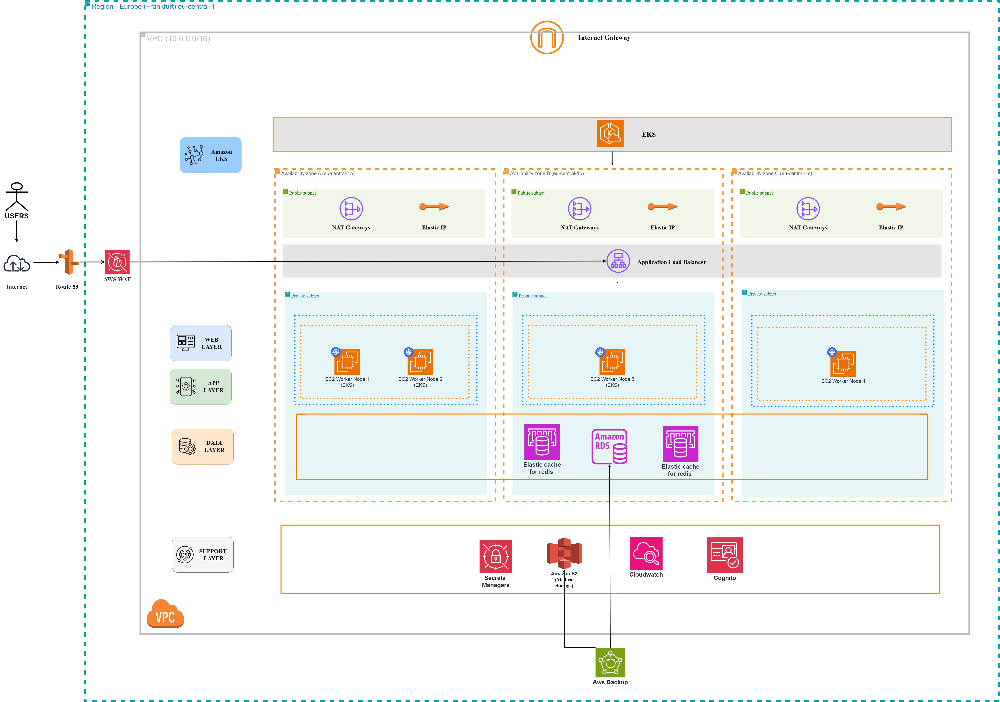

# Regional Clinic Platform: Architecture & Capacity Planning

 

## 📌 Project Overview
This repository contains the comprehensive architectural design, capacity dimensioning, and system modeling for a Regional Clinic Platform. The system is designed to handle electronic health records (EHR), appointment booking, and real-time teleconsultation (WebRTC) for up to 1,000 concurrent users under stringent high availability (HA) and GDPR compliance requirements.

This project was developed as part of the "Cloud Systems Design" course for the MSc program at Harokopio University of Athens.

## 👥 Project Team
* **Katsimpras Drosos** * **Likollari Arntit**
* **Institution:** Harokopio University of Athens (DIT)
* **Course:** Cloud System Design
  
## 🎯 Key Architectural Objectives
* **High Availability (HA):** 99.9% SLA (Three Nines) with N+1 redundancy across all tiers.
* **Performance:** Sub-2 second response time for standard transactions and dedicated 2 Gbps bandwidth for HD video streaming.
* **Security & Compliance:** Full GDPR compliance, AES-256 encryption (At-Rest/In-Transit), and WORM-compliant Audit Logs.
* **Disaster Recovery:** RTO of <10 minutes and RPO of <1 minute using Multi-AZ deployments and automated AWS Backup strategies.

## 🛠 Methodology & Modeling
The design process follows the **Model-Based Systems Engineering (MBSE)** approach:
1. **Requirements Analysis:** Translating clinical needs into strict Functional and Non-Functional Requirements (NFRs).
2. **System-Level Dimensioning:** Mathematical calculation of required vCPUs, RAM, and Storage using a Conservative Sizing strategy.
3. **SysML Modeling:** Utilizing Systems Modeling Language (SysML) to map logical components and establish full traceability between system requirements and physical resources.

## 📁 Repository Structure
The project is organized into the following directory structure to ensure traceability and ease of access to all architectural artifacts:

| Directory | Content Description |
| :--- | :--- |
| **`docs/`** | Contains the full academic report in PDF format, detailing the system-level sizing, mathematical formulas, and architectural decisions. |
| **`diagrams/`** | High-resolution exports (PNG/SVG/JPG) of all system diagrams for detailed review of blocks and requirements. |
| **`src/`** | Source modeling files, including the Visual Paradigm (`.vpp`) project and any flowchart sources (`.drawio`). |

---

## 🚀 Phase II: Cloud Evolution (IaaS + PaaS)
The project successfully evolved from an On-Premise Baseline to a fully Cloud-Native architecture on **Amazon Web Services (AWS)**. By combining Infrastructure as a Service (IaaS) and Platform as a Service (PaaS), the system achieves true elasticity, cost optimization (FinOps), and fault tolerance. 

Key AWS integrations include:
* **Amazon EKS:** Managed Kubernetes Control Plane for container orchestration and Auto-scaling.
* **Amazon RDS (Multi-AZ):** Automated failover and synchronous replication for PostgreSQL.
* **Amazon S3:** Highly durable object storage for medical records, replacing traditional EBS volumes.
* **AWS Cognito:** Managed Identity Proxying for secure user authentication.
* **AWS CloudWatch:** Managed Monitoring for the services.
